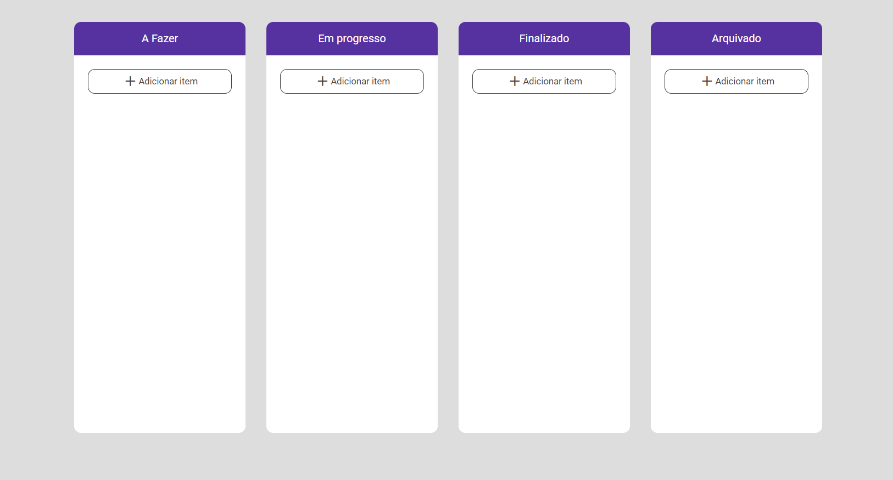

🖥️ Projeto
Esse é um projeto Web desenvolvido no curso de Dev Fullstack da Infinity School com o professor Luan Oliveira.
🔎 Tecnologias
Esse projeto foi desenvolvido com as seguintes tecnologias:
•	HTML
•	CSS
•	JS
•	Github
🎨 Layout
Você pode visualizar o layout do projeto através desse link e desse link
🧑‍💻 Creditos
Projeto foi feito em casa para projetos de aula na Infinity School.
Professor Luan Oliveira.

